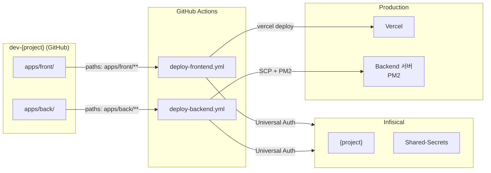

# Architecture

> dev-{project} 모노레포의 전체 아키텍처

## 레포 구조

```
dev-{project}/
├── apps/
│   ├── front/       Next.js 15 (App Router)
│   └── back/        Express 5 + Prisma
├── .github/workflows/
│   ├── deploy-frontend.yml
│   └── deploy-backend.yml
└── scripts/
    └── init-project.sh
```

**모노레포 1개**에서 frontend와 backend를 함께 관리하고, GitHub Actions의 `paths` 필터로 변경된 앱만 독립 배포합니다.

## 배포 아키텍처



## 시크릿 계층

| 레이어               | 저장소                                         | 예시                                             |
| -------------------- | ---------------------------------------------- | ------------------------------------------------ |
| **CI 인증**          | GitHub Secrets                                 | `INFISICAL_CLIENT_ID`, `INFISICAL_CLIENT_SECRET` |
| **배포 변수**        | Infisical `{project}/backend/github-actions/`  | SSH 키, 서버 IP, 쉘스크립트 경로                 |
| **Vercel 배포 변수** | Infisical `{project}/frontend/github-actions/` | VERCEL_ORG_ID, VERCEL_PROJECT_ID                 |
| **Vercel 토큰**      | Infisical `Shared-Secrets/vercel/`             | VERCEL_TOKEN                                     |
| **앱 런타임 env**    | Infisical `{project}/backend/` + `/frontend/`  | DATABASE*URL, JWT_SECRET, NEXT_PUBLIC*\*         |
| **공용 알림**        | Infisical `Shared-Secrets/slack/`              | slack_bot_token, slack_channel                   |

## Layer Architecture (Backend)

```
Router → Service → Repository
```

- **Router**: HTTP 요청 받기, 입력 검증(Zod), Service 호출
- **Service**: 비즈니스 로직, 트랜잭션 경계
- **Repository**: Prisma 쿼리만 (DB 접근 캡슐화)

엄격 분리: Router가 Repository를 직접 호출하지 않음. Service는 HTTP 객체를 알지 못함.

## Layer Architecture (Frontend)

FSD-lite:

- `src/app/` — 라우팅, 레이아웃
- `src/features/` — 피처 단위 (피처 간 import 금지)
- `src/components/common/` — 공통 UI
- `src/lib/` — 유틸, API 클라이언트, Query 훅
- `src/store/` — Jotai atoms
- `src/types/` — 전역 타입

상태 관리:

- 서버 상태 → TanStack Query
- 클라이언트 상태 → Jotai

## API Convention

- Base path: `/api/v1/*`
- 응답 포맷: `{ success: boolean, data?: T, error?: { code, message } }`
- 인증: JWT (Access + Refresh) + CSRF Double Submit
- 에러 핸들링: `errorBoundary` 미들웨어가 모든 예외를 표준 응답으로 변환

## Infrastructure

- **Runtime**: Node.js 24 (mise)
- **Process Manager (Backend)**: PM2 (cluster mode, graceful shutdown)
- **Frontend Hosting**: Vercel
- **Backend Hosting**: 자체 서버 (NHN Cloud, Rocky Linux)
- **Database**: MySQL (Prisma)
- **Cache**: Redis (선택)
- **Secret Management**: Infisical (self-hosted at https://env.co-di.com)

<!-- MANUAL: Notes below this line are preserved on regeneration -->
