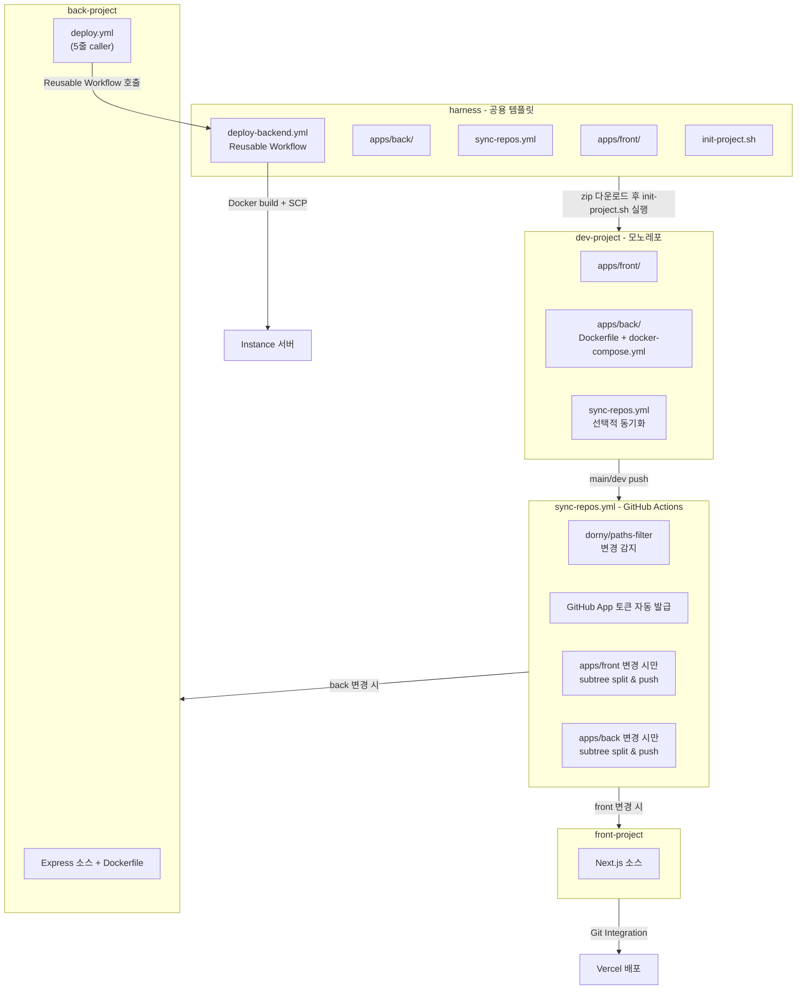
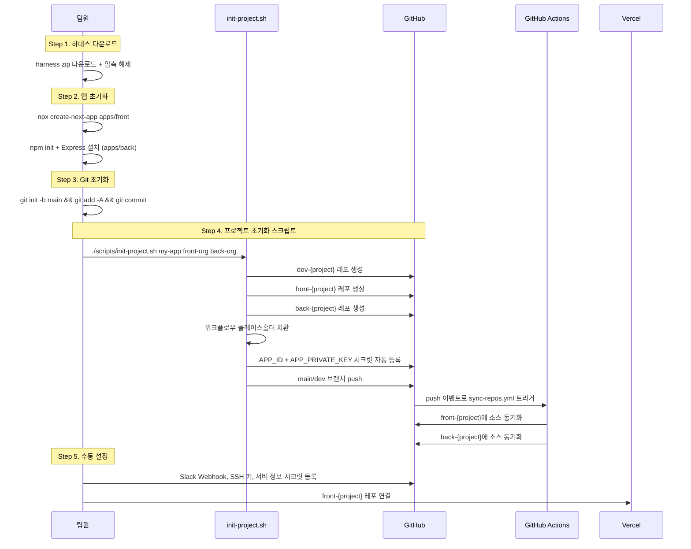
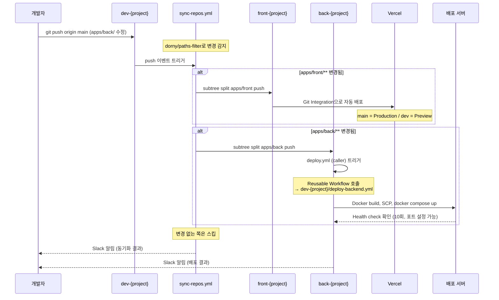
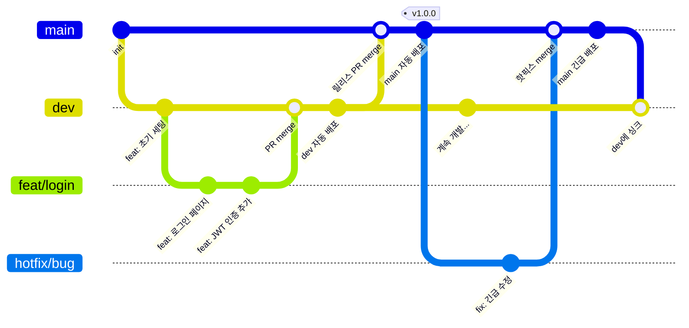
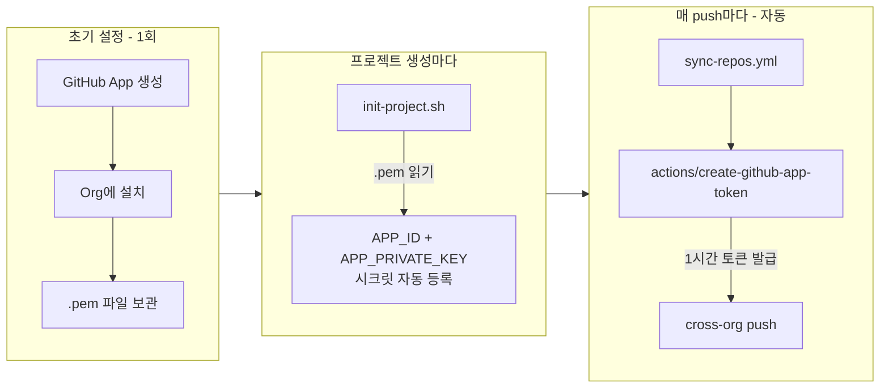
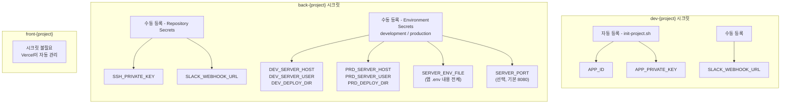
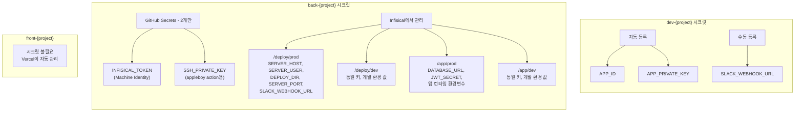
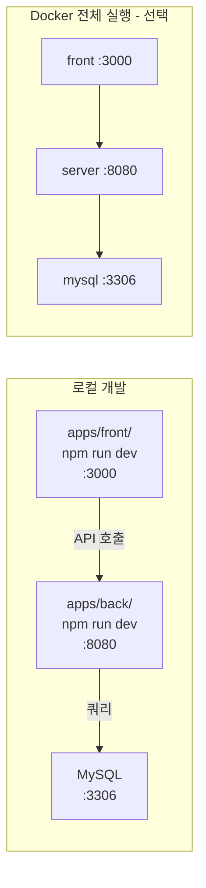

# 멀티레포 배포 파이프라인 가이드

## 전체 구조



> **핵심 변경:** sync-repos.yml이 `dorny/paths-filter`로 변경된 파일만 감지하여 해당 레포만 동기화.
> back-* 레포의 deploy.yml은 5줄짜리 caller로, 실제 배포 로직은 하네스의 deploy-backend.yml (Reusable Workflow)에 집중.

## 새 프로젝트 시작 흐름



## 배포 흐름 (일상 개발)



## 브랜치 전략



| 브랜치 | 용도 | 배포 | 보호 |
|--------|------|------|------|
| `main` | 운영 릴리스 | Production | PR 필수 |
| `dev` | 통합 테스트 | Development | CI 통과 |
| `feat/*` | 기능 개발 | 없음 | - |
| `fix/*` | 버그 수정 | 없음 | - |
| `hotfix/*` | 긴급 수정 | 없음 | - |

## GitHub App 인증 흐름



PAT 방식과의 비교:

| | PAT 방식 | GitHub App 방식 (현재) |
|---|---|---|
| 토큰 생성 | 수동 | 자동 (매 실행마다) |
| 만료 | 최대 1년, 수동 갱신 | 없음 (자동 갱신) |
| 새 프로젝트 | 토큰 수동 등록 | init-project.sh가 자동 등록 |
| Org 승인 | Fine-grained PAT은 Org 승인 필요 | 불필요 (App이 이미 설치됨) |

## 레포별 시크릿 정리

### Phase 1: GitHub Secrets 기반 (현재, Infisical 준비 전)



### Phase 2: Infisical 연동 후 (목표)



## 환경변수 관리 가이드

### 환경변수의 두 가지 레이어

| 레이어 | 용도 | 예시 | 사용 시점 |
|--------|------|------|-----------|
| **앱 런타임** | 애플리케이션이 실행 시 필요한 값 | DATABASE_URL, JWT_SECRET, REDIS_URL | 컨테이너 내부에서 앱이 읽음 |
| **배포 인프라** | CI/CD 파이프라인이 배포 시 필요한 값 | DEPLOY_SERVER, SSH_PRIVATE_KEY, SERVER_PORT | GitHub Actions workflow가 읽음 |

### Phase 1: GitHub Secrets 기반 (현재)

back-* 레포에 직접 등록해야 하는 시크릿 목록:

**Repository Secrets (환경 공통):**

| Secret | 설명 | 필수 |
|--------|------|------|
| `SSH_PRIVATE_KEY` | 배포 서버 SSH 개인 키 | 필수 |
| `SLACK_WEBHOOK_URL` | Slack 알림 Webhook URL | 선택 |

**Environment Secrets (development / production 별도):**

| Secret | 설명 | 필수 | 기본값 |
|--------|------|------|--------|
| `DEV_SERVER_HOST` / `PRD_SERVER_HOST` | 배포 서버 IP | 필수 | - |
| `DEV_SERVER_USER` / `PRD_SERVER_USER` | SSH 접속 유저 | 필수 | - |
| `DEV_DEPLOY_DIR` / `PRD_DEPLOY_DIR` | 배포 디렉터리 경로 | 필수 | - |
| `SERVER_ENV_FILE` | 앱 .env 파일 내용 전체 (멀티라인) | 필수 | - |
| `SERVER_PORT` | 앱 서버 포트 | 선택 | 8080 |

**등록 방법:**
1. back-{project} 레포 → Settings → Secrets and variables → Actions
2. Repository secrets에 SSH_PRIVATE_KEY, SLACK_WEBHOOK_URL 등록
3. Environments → "development" 생성 → Environment secrets에 DEV_* 등록
4. Environments → "production" 생성 → Environment secrets에 PRD_* 등록

### Phase 2: Infisical 연동 후 (목표)

Infisical 서버가 준비되면 GitHub Secrets를 최소화하고 Infisical에서 환경변수를 관리합니다.

**GitHub Secrets에 남는 것 (2개만):**

| Secret | 이유 |
|--------|------|
| `INFISICAL_TOKEN` | Infisical Machine Identity 토큰. CI/CD에서 Infisical API 접근용 |
| `SSH_PRIVATE_KEY` | appleboy/ssh-action이 GitHub Secret으로 직접 받아야 함 |

**Infisical 경로 구조:**

```
프로젝트/
├── deploy/           ← 배포 인프라용 환경변수
│   ├── prod/
│   │   ├── SERVER_HOST=10.0.1.5
│   │   ├── SERVER_USER=ubuntu
│   │   ├── DEPLOY_DIR=/opt/app
│   │   ├── SERVER_PORT=8080
│   │   └── SLACK_WEBHOOK_URL=https://hooks.slack.com/...
│   └── dev/
│       ├── SERVER_HOST=10.0.2.10
│       ├── SERVER_USER=ubuntu
│       ├── DEPLOY_DIR=/opt/app-dev
│       ├── SERVER_PORT=8080
│       └── SLACK_WEBHOOK_URL=https://hooks.slack.com/...
│
└── app/              ← 앱 런타임용 환경변수
    ├── prod/
    │   ├── DATABASE_URL=mysql://...
    │   ├── JWT_SECRET=...
    │   └── REDIS_URL=...
    └── dev/
        ├── DATABASE_URL=mysql://...
        ├── JWT_SECRET=...
        └── REDIS_URL=...
```

**deploy-backend.yml에서의 사용:**

```yaml
# Infisical CLI로 배포 인프라 변수 가져오기
- name: Install Infisical CLI
  run: |
    curl -1sLf 'https://dl.cloudsmith.io/public/infisical/infisical-cli/setup.deb.sh' | sudo -E bash
    sudo apt-get install -y infisical

- name: Export deploy config
  run: |
    ENV_NAME=${{ inputs.environment == 'production' && 'prod' || 'dev' }}
    # 배포 인프라 변수 → GITHUB_ENV에 주입
    infisical export --env=$ENV_NAME --path="/deploy" --format=dotenv | \
      while IFS='=' read -r key value; do
        echo "${key}=${value}" >> $GITHUB_ENV
      done
    # 앱 런타임 변수 → .env 파일로 생성
    infisical export --env=$ENV_NAME --path="/app" --format=dotenv > .env
  env:
    INFISICAL_TOKEN: ${{ secrets.INFISICAL_TOKEN }}
```

**전환 절차:**
1. Infisical 서버 구축 + Machine Identity 토큰 발급
2. Infisical에 `/deploy/prod`, `/deploy/dev`, `/app/prod`, `/app/dev` 경로 생성
3. 기존 GitHub Secrets 값을 Infisical에 복사
4. back-* 레포에 `INFISICAL_TOKEN` Secret 등록
5. deploy-backend.yml에서 Infisical CLI 블록 활성화, 기존 GitHub Secrets 참조 제거
6. 검증 후 back-* 레포에서 불필요한 GitHub Secrets 삭제

### Reusable Workflow 구조

배포 로직은 하네스의 `deploy-backend.yml`에 한 번만 정의하고, 각 back-* 레포는 5줄짜리 caller로 호출합니다.

```
하네스 (dev-{project})
└── .github/workflows/deploy-backend.yml     ← 배포 로직 (Reusable Workflow)
    - Docker build + SCP + health check + Slack

back-{project}
└── .github/workflows/deploy.yml             ← 5줄짜리 caller
    - uses: {BACK_ORG}/{DEV_REPO}/.github/workflows/deploy-backend.yml@main
    - secrets: inherit
```

**배포 로직 수정 시:** 하네스의 deploy-backend.yml 1개만 수정하면 모든 back-* 프로젝트에 자동 반영.

## 커밋 컨벤션

```
<type>: <한글 설명>
```

**description은 반드시 한글로 작성합니다.** type 접두사만 영문.

```
feat: 로그인 페이지 구현
fix: 토큰 만료 시 리다이렉트 안 되는 문제 수정
chore: GitHub App 기반 배포 파이프라인 추가
refactor: 사용자 인증 로직 분리
docs: README 멀티레포 파이프라인 설명 추가
```

| Type | 용도 |
|------|------|
| `feat` | 새 기능 |
| `fix` | 버그 수정 |
| `chore` | 빌드, 설정 변경 |
| `refactor` | 리팩터링 |
| `docs` | 문서 |
| `style` | 포맷팅 |
| `test` | 테스트 |
| `perf` | 성능 개선 |

## 로컬 개발 환경



```bash
# 개별 실행
cd apps/front && npm run dev    # http://localhost:3000
cd apps/back && npm run dev     # http://localhost:8080

# Docker로 전체 실행
cd docker
docker compose -f docker-compose.yml -f docker-compose.dev.yml up --build
```

## 디렉토리 구조

```
dev-{project}/
├── apps/
│   ├── front/                  # front-{project}로 동기화
│   │   ├── src/
│   │   ├── package.json
│   │   └── next.config.ts
│   └── back/                   # back-{project}로 동기화
│       ├── src/
│       ├── prisma/
│       ├── package.json
│       ├── Dockerfile          # back-* 레포 루트 기준 Docker 빌드
│       ├── docker-compose.yml  # EC2 서버에 scp로 전송됨
│       └── .dockerignore       # .env 등 민감파일 제외
├── .github/workflows/
│   ├── sync-repos.yml          # 선택적 동기화 (paths-filter)
│   └── deploy-backend.yml      # Reusable Workflow (중앙 배포 로직)
├── docker/                     # 로컬 개발용 Docker 설정
│   ├── Dockerfile.front
│   ├── docker-compose.yml
│   ├── docker-compose.dev.yml
│   └── docker-compose.prod.yml
├── scripts/
│   └── init-project.sh         # 프로젝트 초기화 (레포 생성 + deploy caller push)
├── templates/
│   └── back-deploy.yml         # back-* 레포용 deploy caller 템플릿 (5줄)
├── .agents/                    # AI 에이전트 스킬
├── .claude/                    # Claude Code 설정
├── CLAUDE.md                   # 프로젝트 규칙 (AI가 읽음)
├── CONTRIBUTING.md             # 개발 가이드 (사람이 읽음)
├── AGENTS.md                   # 에이전트 라우팅 가이드
└── README.md
```

## TODO

- [ ] Infisical 셀프호스팅 서버 구축
- [ ] Infisical Machine Identity 토큰 발급 + 프로젝트별 경로 구성 (/deploy, /app)
- [ ] `.pem` 파일을 Infisical에 보관 (현재: 프로젝트 루트 `codi-repo-sync.private-key.pem`)
- [ ] deploy-backend.yml에서 Infisical CLI 블록 활성화 (위 "Phase 2: Infisical 연동 후" 참고)
- [ ] 기존 GitHub Secrets → Infisical 마이그레이션
- [ ] 로컬 개발 `infisical run -- npm run dev` 전환
- [ ] 서버 프로비저닝 스크립트 (EC2 초기 Docker + docker-compose 설치)
- [ ] Blue-green deploy 검토
- [ ] 자동 롤백 (현재는 수동 롤백 안내만 제공)
