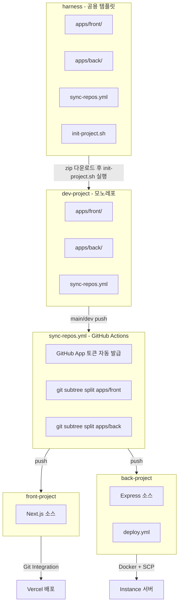
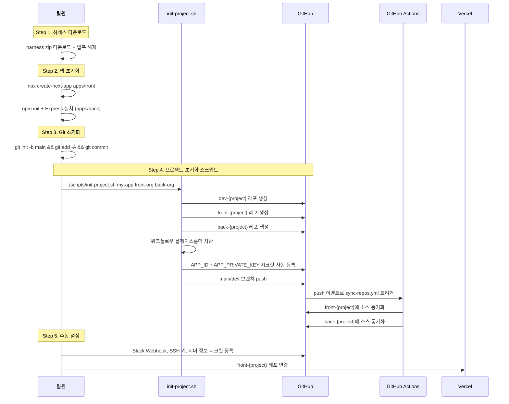
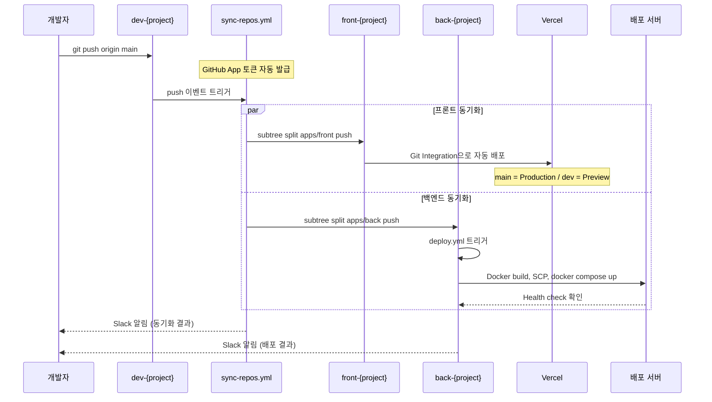
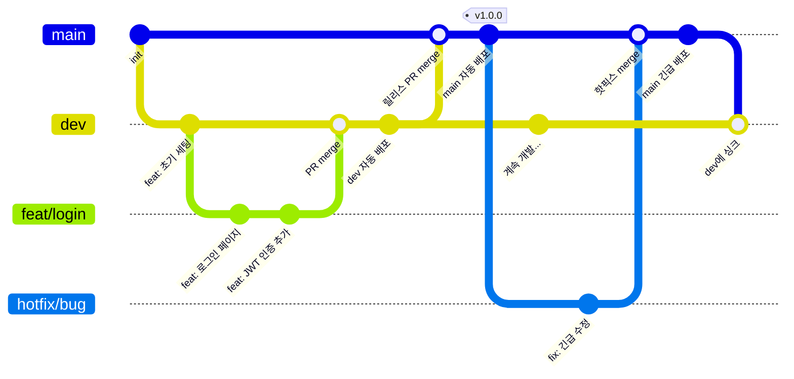
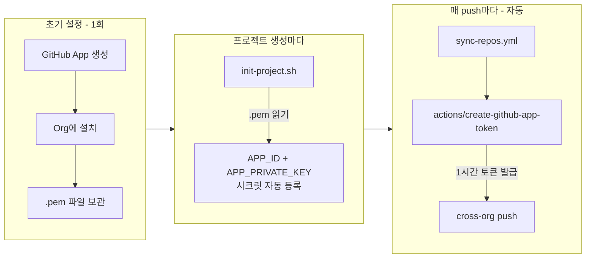
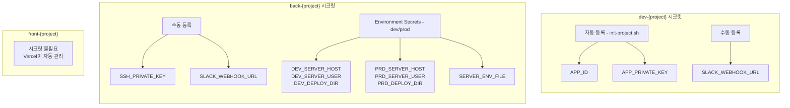
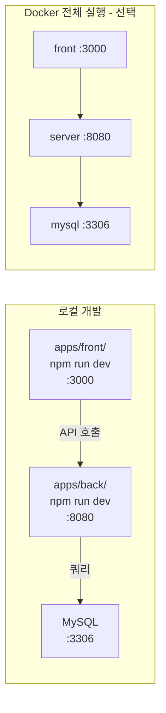

# 멀티레포 배포 파이프라인 가이드

## 전체 구조



## 새 프로젝트 시작 흐름



## 배포 흐름 (일상 개발)



## 브랜치 전략



| 브랜치 | 용도 | 배포 | 보호 |
|--------|------|------|------|
| `main` | 운영 릴리스 | Production | PR 필수 |
| `dev` | 통합 테스트 | Development | CI 통과 |
| `feat/*` | 기능 개발 | 없음 | - |
| `fix/*` | 버그 수정 | 없음 | - |
| `hotfix/*` | 긴급 수정 | 없음 | - |

## GitHub App 인증 흐름



PAT 방식과의 비교:

| | PAT 방식 | GitHub App 방식 (현재) |
|---|---|---|
| 토큰 생성 | 수동 | 자동 (매 실행마다) |
| 만료 | 최대 1년, 수동 갱신 | 없음 (자동 갱신) |
| 새 프로젝트 | 토큰 수동 등록 | init-project.sh가 자동 등록 |
| Org 승인 | Fine-grained PAT은 Org 승인 필요 | 불필요 (App이 이미 설치됨) |

## 레포별 시크릿 정리



## 커밋 컨벤션

```
<type>: <한글 설명>
```

**description은 반드시 한글로 작성합니다.** type 접두사만 영문.

```
feat: 로그인 페이지 구현
fix: 토큰 만료 시 리다이렉트 안 되는 문제 수정
chore: GitHub App 기반 배포 파이프라인 추가
refactor: 사용자 인증 로직 분리
docs: README 멀티레포 파이프라인 설명 추가
```

| Type | 용도 |
|------|------|
| `feat` | 새 기능 |
| `fix` | 버그 수정 |
| `chore` | 빌드, 설정 변경 |
| `refactor` | 리팩터링 |
| `docs` | 문서 |
| `style` | 포맷팅 |
| `test` | 테스트 |
| `perf` | 성능 개선 |

## 로컬 개발 환경



```bash
# 개별 실행
cd apps/front && npm run dev    # http://localhost:3000
cd apps/back && npm run dev     # http://localhost:8080

# Docker로 전체 실행
cd docker
docker compose -f docker-compose.yml -f docker-compose.dev.yml up --build
```

## 디렉토리 구조

```
dev-{project}/
├── apps/
│   ├── front/                  # front-{project}로 동기화
│   │   ├── src/
│   │   ├── package.json
│   │   └── next.config.ts
│   └── back/                   # back-{project}로 동기화
│       ├── src/
│       ├── prisma/
│       └── package.json
├── .github/workflows/
│   ├── sync-repos.yml          # subtree split으로 배포 레포 push
│   └── deploy.yml              # Docker 빌드/배포 (레거시)
├── docker/
│   ├── Dockerfile.front
│   ├── Dockerfile.server
│   ├── docker-compose.yml
│   ├── docker-compose.dev.yml
│   └── docker-compose.prod.yml
├── scripts/
│   └── init-project.sh         # 프로젝트 초기화 자동화
├── templates/
│   └── back-deploy.yml         # back-{project} 배포 워크플로우
├── .agents/                    # AI 에이전트 스킬
├── .claude/                    # Claude Code 설정
├── CLAUDE.md                   # 프로젝트 규칙 (AI가 읽음)
├── CONTRIBUTING.md             # 개발 가이드 (사람이 읽음)
├── AGENTS.md                   # 에이전트 라우팅 가이드
└── README.md
```

## TODO

- [ ] Infisical 셀프호스팅 서버 구축
- [ ] `.pem` 파일을 Infisical에 보관 (현재: 프로젝트 루트 `codi-repo-sync.private-key.pem`)
- [ ] `SLACK_WEBHOOK_URL`을 Infisical에서 관리
- [ ] CI/CD에서 GitHub Secrets를 Infisical로 전환
- [ ] 로컬 개발 `infisical run -- npm run dev` 전환
